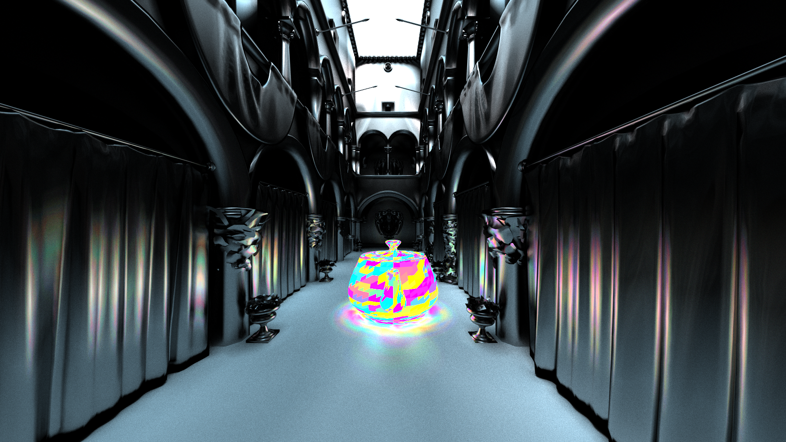

# rusttracer

A CPU ray tracer written in rust with SIMD and multithreading.




Visualizing BVH structure:


# Running

Instal rust and cargo, run with `cargo run --release`, pass options using:

```
cargo run --release -- -W 512 -H 512 ...
```

Supported options:

```
  -W, --width <WIDTH>          [default: 512]
  -H, --height <HEIGHT>        [default: 512]
  -s, --samples <SAMPLES>      [default: 32]
  -o, --output <OUTPUT>        [default: render.png]
  -t, --tile-size <TILE_SIZE>  [default: 16]
      --incremental
      --threads <THREADS>
      --dump-bvh <DUMP_BVH>
  -h, --help                   Print help
```
